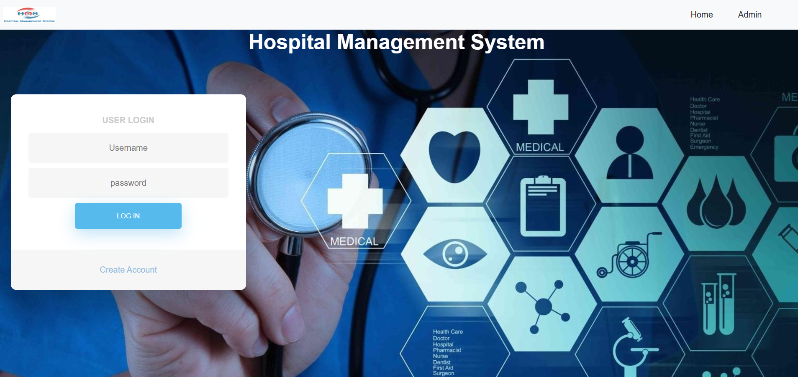
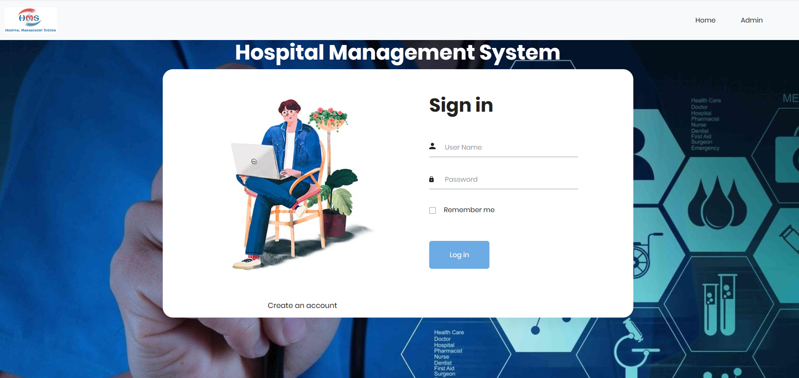
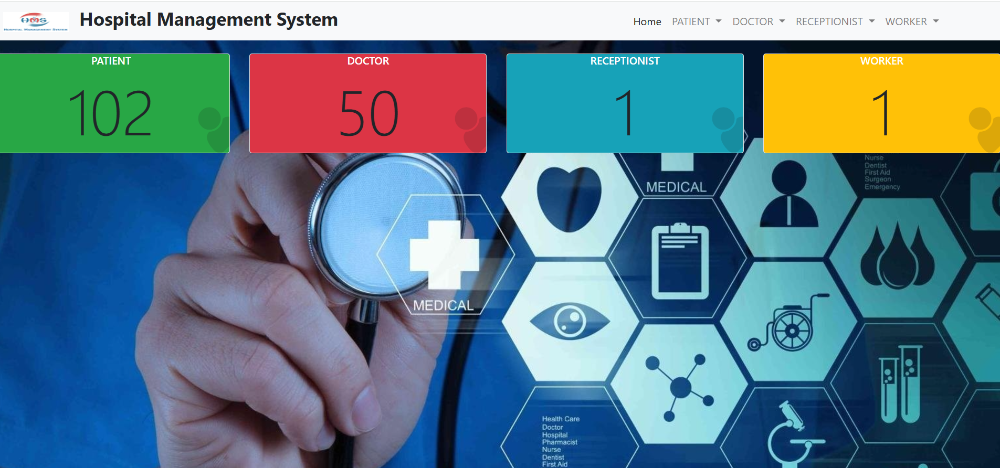
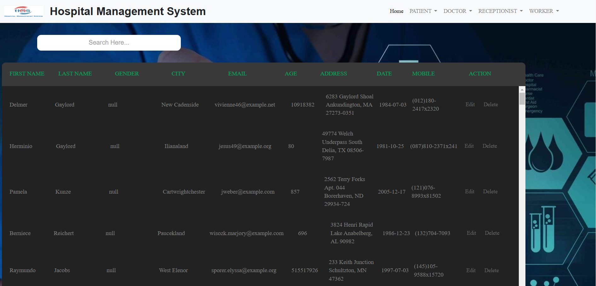
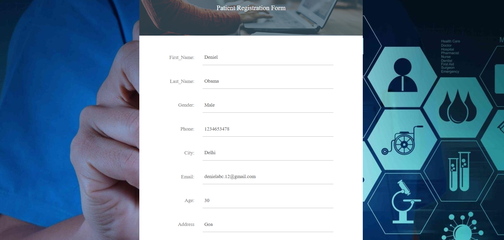

# Hospital Management System

## Overview
The **Hospital Management System** is a web-based application built using Java Servlets and JSP. It provides functionalities for managing patients, doctors, and receptionists efficiently. The system is designed for hospital administrators who can view, add, and update details of patients, doctors, and receptionists through a user-friendly interface.

---

## Features
### Admin Features
- **Patient Management**  
  - Add new patients.  
  - View patient details.  
  - Update patient information.  

- **Doctor Management**  
  - Add new doctors.  
  - View doctor details.  
  - Update doctor information.  

- **Receptionist Management**  
  - Add new receptionists.  
  - View receptionist details.  
  - Update receptionist information.  

### Security  
- Role-based access control for the administrator.  

---

## Technologies Used
- **Backend**: Java Servlets, JSP  
- **Frontend**: HTML, CSS, JavaScript  
- **Database**: MySQL  
- **Server**: Apache Tomcat  

---


##  Screenshot

Below is a screenshot of the `BankAccount` class where core ATM functionalities such as deposit and withdraw methods are implemented.













## Getting Started

To get a local copy up and running, follow these steps.

### Prerequisites

- Java Development Kit (JDK) 8 or above
- Java IDE (such as IntelliJ IDEA, Eclipse, or NetBeans)

### Installation

1. Clone the repository:
   ```bash
   git clone https://github.com/Snehapandey04/Brainwave_Matrix_Intern_HospitalManagement.git
